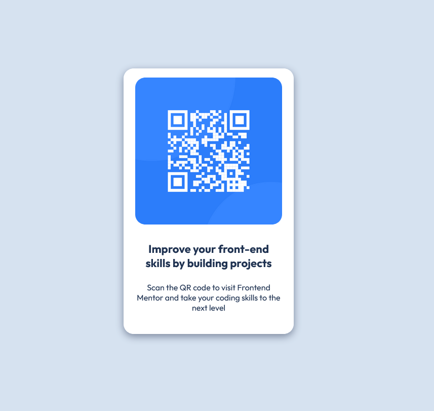

# Frontend Mentor - QR code component solution

This is a solution to the [QR code component challenge on Frontend Mentor](https://www.frontendmentor.io/challenges/qr-code-component-iux_sIO_H). Frontend Mentor challenges help you improve your coding skills by building realistic projects. Personally coming from me, it's a great website to practice your skills in.

## Table of contents

- [Overview](#overview)
  - [Screenshot](#screenshot)
  - [Links](#links)
- [My process](#my-process)
  - [Built with](#built-with)
  - [What I learned](#what-i-learned)
  - [Continued development](#continued-development)
  - [Useful resources](#useful-resources)
- [Author](#author)
- [Acknowledgments](#acknowledgments)


## Overview

### Screenshot



This is the website that I made. It is made in 1 hour. This doesn't have any special javascript or frameworks, just plain HTML and CSS.

### Links

- Solution URL: [Add solution URL here](https://your-solution-url.com)
- Live Site URL: [Add live site URL here](https://your-live-site-url.com)

## My process

### Built with

- Semantic HTML5 markup
- Flexbox
- DRY flow


### What I learned

I never heard of google fonts before. If I needed custom fonts, I would just download the font file. With Google Fonts, I don't need to download multiple files. I used to learn in a bootcamp that told me a font file was the only way to integrate custom fonts. Therefore, I never saw its so easy to integrate like this: 

```css
body {
  font-family: 'Outfit', sans-serif;
}
```


### Continued development

Colors are a major issue for me. I can't seem to check color contrast on some colors. This is a big issue in my portfolio where I adapted the colors in dark mode. I am looking to make this 🪳 of mine to disappear. (sorry for the cheesy joke) Just addressing the elephant in the room, I am also looking to make a website a walk in the park for anyone who is differently abled. 


## Author

- Github: 


